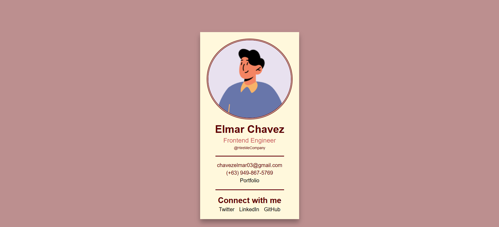

# 💻 Business Card

## ℹ️ A Business Card Design Project

This project is a clean and minimal business card component created using only HTML and CSS. It mimics the design of a modern business profile card with user information, contact details, and social media links—all wrapped in a visually appealing layout.

It was built entirely with HTML and CSS as part of the [**freeCodeCamp.org**](https://www.freecodecamp.org/learn/full-stack-developer/) CSS course.

---

## 🔍 Overview

This project contains a responsive business card layout featuring a profile image, name, job title, company, contact info, and social links. The card uses semantic HTML and clear class naming for structure, along with consistent visual styling via CSS variables and shadows.

It’s styled using modern design principles such as box shadows, border-radius, and variable-based theming. The layout centers the card for desktop and small screen widths using margin and responsive max-width settings.

---

## ✨ Features

- Responsive business card layout
- Semantic HTML5 structure
- Profile image with border and radius
- Highlighted headings and job title
- Styled social media link section
- Visual hierarchy using font sizes and weights
- CSS custom properties (variables) for easy theming
- Accessible link focus and hover effects

---

## 🧠 What I Learned

- How to build a card UI component with HTML and CSS
- Applying semantic HTML for better structure and accessibility
- Managing styling with custom CSS variables
- Creating consistent visual hierarchy using font sizes and spacing
- Styling and structuring a social media links section
- Centering content using `margin` and `max-width` layout techniques

---

## 🛠️ Tech Used

- HTML5
- CSS3
- Git
- GitHub
- Netlify

---

## 🚀 How to Run

1. Clone the repository
2. Open `index.html` in your browser

---

## 🌐 Live Demo

Or you can check out the 👉 [live website here](https://business-card-fcc-jiro.netlify.app/)

---

## 🧑‍💻 Author

Created by **Elmar Chavez**

🗓️ Month/Year: **May 2025**

📚 Journey: **2nd** month of learning _frontend web development_.
